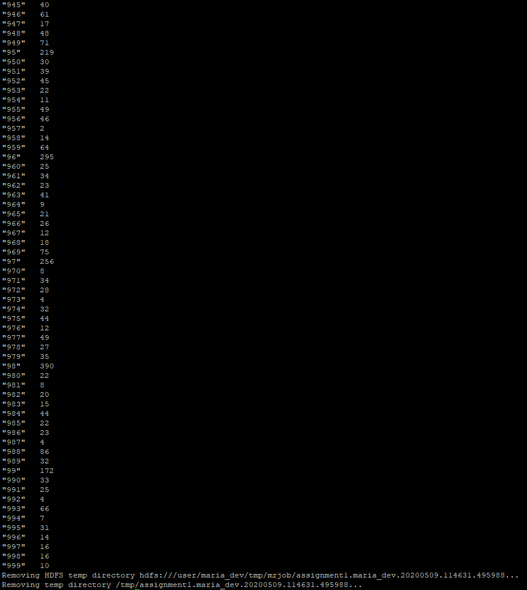

# Assignment 1

_Count the number of ratings given for each movie_

## **Source code**

**GitHub URL:** [https://github.com/616055/pdp\_assignment\_1\_616055/tree/master](https://github.com/616055/pdp_assignment_1_616055/tree/master)

## **Steps to execute code**
1.	Start a SSH connection with a Hadoop Sandbox Virtual Machine
2.	Clone the repository from this GitHub into a directory inside the Virtual Machine
3.	Run the following command to run it without Hadoop:
```
python assignment1.py
```
4.	Run the following command to run it within Hadoop:
```
python assignment1.py -r hadoop --hadoop-streaming-jar /usr/hdp/current/hadoop-mapreduce-client/hadoop-streaming.jar u.data
```

## **Explanation source code**
The MRJob package in imported into this file so it can be used:
```python
from mrjob.job import MRJob
from mrjob.step import MRStep
```

A new Python Class is made and it is using all functionality of MRJob  
```python
class Opdracht1 (MRJob):
```

The steps function is defined, which is used by MRJob.  
A new step (MRStep) is created and the _mapper_ and _reducer_ it should use are set:  
```python
def steps(self):
return [
 MRStep(mapper=self.mapper_get_ratings,
reducer=self.reducer_count_ratings)
]
```

The mapper (which is set in the MRStep) is defined here.  
It has the parameters: _self_ (= the object instance of itself), _\__ (= underscore = unused) and _line_ (= the current line it is reading from the _u.data_ file.  
The current line is getting split on each tab (which is the _\t_) and a tuple is created whit the four fields (userID, movieID, rating and timestamp).  
Each line is one rating, so the current movieID is returned with a occurrence count of &#39;1&#39;.
```python
def mapper_get_ratings(self, _, line):
 (userID, movieID, rating, timestamp) = line.split('/t')
yield movieID, 1
```

The reducer (which is also set in the MRStep) is defined here.  
It has the parameters: _self_ (= the object instance of itself), _key_ (= the unique key of the movieID) and _values_ (= list with all the values which have the current key).  
The key is returned in combination with the sum of all the values (which is something like: 1 + 1 + .. + 1 + 1 = 10).
```python
def reducer_count_ratings (self, key, values):
yield key, sum(values)
```

Finally the _main_ function is created. This function will be called when the Python script is getting runned. In this function the Opdracht1 class, just created, is executed.
```python
if __name__ == '__main__':
    Opdracht1.run()
```

## **Screenshot of result**

